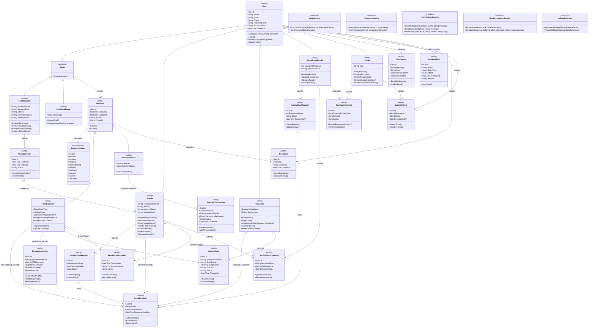

# Lokma Food Donation System — UML Class Diagram

This diagram describes the entities, inheritance, relationships, and operations of Lokma food donation system.

```mermaid
classDiagram
direction TB

class User {
  <<entity>>
  +Guid Id
  +String Name
  +String Email
  +String Phone
  +String PasswordHash
  +String AccountStatus
  +DateTime CreatedAt
  +Login(String email, String password)
  +Logout()
  +ResetPassword(String email)
  +UpdateProfile()
}

class Donor {
  <<abstract>>
  +CreateDonation()
}

class FoodProvider {
  <<entity>>
  +String BusinessName
  +String BusinessType
  +String Address
  +String VerificationStatus
  +String WorkingHours
  +RegisterBusiness()
  +DefinePickupWindow()
  +AcceptFamilyRequest()
  +PerformSafetyCheck()
}

class IndividualDonor {
  <<entity>>
  +String DonorType
  +DonateFood()
  +DonateMoney(Decimal amount)
}

class Charity {
  <<entity>>
  +String OrganizationName
  +String Address
  +String ApprovalStatus
  +String WorkingHours
  +RegisterOrganization()
  +UploadDocuments()
  +BookPickupWindow()
  +CreateFoodRequest()
  +ConfirmReceipt()
  +RejectDonation()
  +ManageVolunteer()
}

class Volunteer {
  <<entity>>
  +Boolean IsAvailable
  +String ServiceArea
  +AcceptTask()
  +RejectTask()
  +UpdateAvailability(Boolean isAvailable)
  +ScanQRCode()
  +PerformSafetyCheck()
}

class BeneficiaryFamily {
  <<entity>>
  +Int NumberOfMembers
  +String ApprovalStatus
  +RegisterFamily()
  +UploadDocuments()
  +RequestFood()
  +ScanQRCode()
}

class Admin {
  <<entity>>
  +String Role
  +VerifyAccount()
  +SuspendAccount()
  +ReviewDocuments()
  +ReviewCharityRejections()
  +PerformRandomVerification()
}

User <|-- Donor
Donor <|-- FoodProvider
Donor <|-- IndividualDonor
User <|-- Charity
User <|-- Volunteer
User <|-- BeneficiaryFamily
User <|-- Admin

class Donation {
  <<entity>>
  +Guid Id
  +DateTime CreatedAt
  +DateTime ExpiresAt
  +String Status
  +String PhotoUrl
  +Cancel()
  +Expire()
}

class FoodDonation {
  <<entity>>
  +String FoodType
  +Int MealCount
  +DateTime PreparationTime
  +String PackagingPreference
  +String PickupLocation
  +RegisterDonation()
  +UpdateDonation()
}

class MoneyDonation {
  <<entity>>
  +Decimal Amount
  +String PaymentStatus
  +ProcessPayment()
}

class DonationStatus {
      <<enumeration>>
      Created
      Matched
      Accepted
      PickedUp
      SafetyChecked
      Delivered
      Confirmed
      Rejected
      Expired
      Cancelled
  }

Donation --> DonationStatus : has status
Donation <|-- FoodDonation
Donation <|-- MoneyDonation
Donor "1" --> "0..*" Donation : creates

class CharityFoodRequest {
  <<entity>>
  +Guid Id
  +Int RequestedMeals
  +DateTime NeededBy
  +String Status
  +CreateRequest()
  +UpdateStatus()
}

class FamilyFoodRequest {
  <<entity>>
  +Guid Id
  +Int RequestedMeals
  +String Status
  +DateTime RequestedAt
  +CreateRequest()
  +UpdateStatus()
}

Charity "1" --> "0..*" CharityFoodRequest : submits
BeneficiaryFamily "1" --> "0..*" FamilyFoodRequest : submits

class DonationMatch {
  <<entity>>
  +Guid Id
  +String Status
  +DateTime MatchedAt
  +DateTime ResponseDeadline
  +MatchDonation()
  +AcceptMatch()
  +RejectMatch()
}

FoodDonation "1" --> "0..*" DonationMatch : has matching attempts
Charity "0..1" --> "0..*" DonationMatch : nominated charity
Volunteer "0..1" --> "0..*" DonationMatch : nominated volunteer
CharityFoodRequest "0..1" --> "0..*" DonationMatch : fulfills
FamilyFoodRequest "0..1" --> "0..*" DonationMatch : fulfills

class PickupWindow {
  <<entity>>
  +Guid Id
  +DateTime StartTime
  +DateTime EndTime
  +String Status
  +CreatePickupWindow()
  +BookWindow()
}

FoodProvider "1" --> "0..*" PickupWindow : defines
PickupWindow "0..*" --> "0..1" Charity : booked by

class PickupVerification {
  <<entity>>
  +Guid Id
  +String QRCodeReference
  +String OTPReference
  +DateTime ExpiresAt
  +DateTime UsedAt
  +Boolean IsUsed
  +GenerateQRCode()
  +ValidateQRCode()
  +RecordAttempt()
}

FoodDonation "1" --> "0..*" PickupVerification : verification records

class SafetyCheck {
  <<entity>>
  +Guid Id
  +String AppearanceResult
  +String SmellResult
  +Decimal Temperature
  +String PhotoUrl
  +String Result
  +DateTime CheckedAt
  +RecordCheck()
  +ValidateSafety()
}

FoodDonation "1" --> "0..*" SafetyCheck : safety records
Volunteer "1" --> "0..*" SafetyCheck : performs

class ReceiptConfirmation {
  <<entity>>
  +Guid Id
  +DateTime ConfirmedAt
  +String ConfirmationStatus
  +String Notes
  +ConfirmDelivery()
  +RecordReceipt()
}

FoodDonation "1" --> "0..*" ReceiptConfirmation : receipt history
Charity "0..1" --> "0..*" ReceiptConfirmation : confirms receipt

class PaymentTransaction {
  <<entity>>
  +Guid Id
  +Decimal Amount
  +String PaymentProvider
  +String TransactionReference
  +String Status
  +DateTime CreatedAt
  +InitiatePayment()
  +VerifyTransaction()
}

MoneyDonation "1" --> "0..*" PaymentTransaction : payment attempts

class Notification {
  <<entity>>
  +Guid Id
  +String Message
  +String Type
  +DateTime CreatedAt
  +DateTime ReadAt
  +SendNotification()
  +MarkAsRead()
}

User "1" --> "0..*" Notification : receives

class AuditLogEntry {
  <<entity>>
  +Guid Id
  +String Action
  +String EntityType
  +Guid EntityId
  +DateTime Timestamp
  +String Reason
  +LogAction()
}

User "0..1" --> "0..*" AuditLogEntry : performs action

class VerificationDocument {
  <<entity>>
  +Guid Id
  +String DocumentType
  +String FileReference
  +String ReviewStatus
  +UploadDocument()
  +ReviewDocument()
}

Charity "1" --> "0..*" VerificationDocument : submits
BeneficiaryFamily "1" --> "0..*" VerificationDocument : submits

class FamilyVerification {
  <<entity>>
  +Guid Id
  +DateTime VerificationDate
  +String Result
  +String Notes
  +TriggerRandomVerification()
  +ReviewVerification()
}

BeneficiaryFamily "1" --> "0..*" FamilyVerification : undergoes
Admin "0..1" --> "0..*" FamilyVerification : reviews

class Feedback {
  <<entity>>
  +Guid Id
  +Int Rating
  +String Comment
  +DateTime CreatedAt
  +SubmitFeedback()
  +CalculateRating()
}

Donation "1" --> "0..*" Feedback : receives
User "1" --> "0..*" Feedback : submits

class SupportTicket {
  <<entity>>
  +Guid Id
  +String Description
  +String Status
  +DateTime CreatedAt
  +CreateTicket()
  +ResolveTicket()
}

User "1" --> "0..*" SupportTicket : submits
Admin "0..1" --> "0..*" SupportTicket : handles

%% System & External Service Interfaces
class IMapService {
  <<interface>>
  +CalculateDistance(String source, String destination)
  +GetDirections(String location)
}

class IPaymentService {
  <<interface>>
  +ProcessPayment(Decimal amount, String token)
  +VerifyTransaction(String transactionReference)
}

class INotificationService {
  <<interface>>
  +SendPushNotification(Guid userId, String message)
  +SendSMS(String phone, String message)
  +SendEmail(String email, String subject, String body)
}

class IBackgroundJobService {
  <<interface>>
  +ScheduleJob(Action task, TimeSpan delay)
  +ScheduleRecurringJob(String jobId, Action task, String cronExpression)
}

class IQRCodeService {
  <<interface>>
  +GenerateQRCode(String referenceData)
  +ValidateQRCode(String qrCodeReference)
}

```
